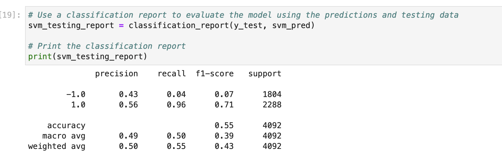
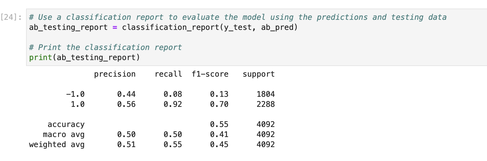

# Application - Machine Learning Trading Bot


### Background

To manage and automatically trade assets in a highly dynamic environment. Use heavily profiting computer algorithms that can buy and sell faster than human traders.

The speed of these transactions gives a competitive advantage. But, people still need to specifically program these systems, which limits their ability to adapt to new data. Thus planning to improve the existing algorithmic trading systems and maintain the competitive advantage in the market. Enhance the existing trading signals with machine learning algorithms that can adapt to new data.

### What's Created

We will combine your new algorithmic trading skills with existing skills in financial Python programming and machine learning to create an algorithmic trading bot that learns and adapts to new data and evolving markets.

In a Jupyter notebook, we will:

* Implement an algorithmic trading strategy that uses machine learning to automate the trade decisions.

* Adjust the input parameters to optimize the trading algorithm.

* Train a new machine learning model and compare its performance to that of a baseline model.

We will also create a report that compares the performance of the machine learning models based on the trading predictions that each makes and the resulting cumulative strategy returns.

### Files

Following files will be used:

[File]: https://github.com/rchak007/MLTradingBot/Resources/	"OHLCV data"


> **Deep Dive** The provided CSV file contains OHLCV data for an MSCI&ndash;based emerging markets ETF that [iShares](https://www.ishares.com/us/products/268704/ishares-currency-hedged-msci-emerging-markets) issued. Investments in emerging markets make up an important aspect of a well-diversified investment portfolio. This is because the included equities have potentially higher long-term returns, even though they carry more risk.

### Steps

Steps that will be followed:

* Establish a Baseline Performance

* Tune the Baseline Trading Algorithm

* Evaluate a New Machine Learning Classifier

* Create an Evaluation Report

#### Establish a Baseline Performance

Establish a baseline performance for the trading algorithm. 


1. Import the OHLCV dataset into a Pandas DataFrame.

2. Generate trading signals using short- and long-window SMA values.

3. Split the data into training and testing datasets.

4. we will Use the `SVC` classifier model from SKLearn's support vector machine (SVM) learning method to fit the training data and make predictions based on the testing data. Review the predictions.

5. Review the classification report associated with the `SVC` model predictions.

6. Create a predictions DataFrame that contains columns for “Predicted” values, “Actual Returns”, and “Strategy Returns”.

7. Create a cumulative return plot that shows the actual returns vs. the strategy returns. Save a PNG image of this plot. This will serve as a baseline against which to compare the effects of tuning the trading algorithm.

8. Write your conclusions about the performance of the baseline trading algorithm in the `README.md` file that’s associated with your GitHub repository. Support your findings by using the PNG image that you saved in the previous step.

#### Tune the Baseline Trading Algorithm

Then we will tune, or adjust, the model’s input features to find the parameters that result in the best trading outcomes. We will choose the best by comparing the cumulative products of the strategy returns. 

1. Tune the training algorithm by adjusting the size of the training dataset. To do so, we slice data into different periods. Rerun the notebook with the updated parameters, and record the results. We will see- What impact resulted from increasing or decreasing the training window?

> To adjust the size of the training dataset, we can use a different `DateOffset` value&mdash;for example, six months. This will change the size of the training dataset also affects the size of the testing dataset.

2. Tune the trading algorithm by adjusting the SMA input features. We will Adjust one or both of the windows for the algorithm. Rerun the notebook with the updated parameters, and record the results. Then lets see the impact resulted from increasing or decreasing either or both of the SMA windows?

3. we will choose the set of parameters that best improved the trading algorithm returns. Save a PNG image of the cumulative product of the actual returns vs. the strategy returns, and document our conclusion .

#### Evaluate a New Machine Learning Classifier

We will also use the original parameters provided. But, we willl apply them to the performance of a second machine learning model. 

1. Import a new classifier, such as `AdaBoost`, `DecisionTreeClassifier`, or `LogisticRegression`. (For the full list of classifiers, refer to the [Supervised learning page](https://scikit-learn.org/stable/supervised_learning.html) in the scikit-learn documentation.)

2. Using the original training data as the baseline model, fit another model with the new classifier.

3. We will backtest the new model to evaluate its performance. Save a PNG image of the cumulative product of the actual returns vs. the strategy returns for this updated trading algorithm, and write our conclusions. then we can see: Did this new model perform better or worse than the provided baseline model? Did this new model perform better or worse than your tuned trading algorithm?


# Evaluation Report


## Analysis of the Actual Returns vs. SVC Model Returns

### Short 4, Long 100, DateOffset 3 months

SVM's SVC classifier was the initial machine learning algorithm that was evaluated. It was created using the following key parameters to determine both the algorithm and that training data:

```python
short_window = 4
long_window = 100
DateOffset = 3 months
```

The overall accuracy score of this SVC model with these parameters was 0.55.

Based on the comparison of cumulative returns between the actual returns of the ETF and the returns using the SVC model predictions, predictions using the SVC model returned a slight out-performance (SVC 1.52 vs actual 1.386)





---

## Analysis of Actual Returns vs. Tuned ML Bot Returns


### Step 1: Short 4, Long 100, DateOffset 24 months

For the first alteration, the short and long window periods were kept at their original values of 4 and 100, respectively, and the training period adusted to 24 months.

```python
short_window = 4
long_window = 100
DateOffset = 24 months
```

The cumulative returns that resulted from chaning the periods associated with the training and testing data can be seen in the following image. 


By changing the training window, both the model accuracy score, and the cumlative performace of the strategy did improve. The accuracy score was reported at 0.56 and the cumulative preformace at 1.634%. 

Overall, increasing the training window imporved the performance of the model.  


### Step 2: Short 50, Long 200, DateOffset 3 Months

For this version up updating the SVM machine learning model, the short window was adjusted to 50 periods, and the long window to 200 periods. The DateOffset parameter stayed the same at 3 months.

```python
short_window = 50
long_window = 200
DateOffset = 3 months
```

An image of the cumulative retrun data for this version of the model is seen below:


The accuracy score of the SVC model using the above parameters was roughly in-line with the previous models 0.54.

In terms of cumulative performance, the SVM strategy actually underperformed using these parameters, returning only 1.437 versus the actual return value of 1.565.

Three months was clearly not enough time to train the SVC model with a short window of 50 periods and a long window of 200.

### Step 3: Short 50, Long 200, DateOffset 24 Months

It is interesting to note that if the DateOffset period was adjusted to 24 month in order to accomodate the longer short and long window periods, the performance does improve drastically. 

```python
short_window = 50
long_window = 200
DateOffset = 24 months
```

As seen in the following image, the model actually returns 1.83% versus actual returns of 1.398%. 


Not surprisingly, the longer windows allows for better pattern recognition with regard to the behavior of the ETF over time, and the longer training period gives the model additional opportunity to learn based on the data. 

---

## Analysis of Actual Returns vs. AdaBoost Returns

The original parameters, as seen below, were evaluated using the AdaBoost Classifier model.

```python
short_window = 4
long_window = 100
DateOffset = 3 months
```

The overall accuracy of the AdaBoost classifier model was in line with the SVC's at 0.55

The AdaBoost Classifier returned an on overall performance of 1.571 as seen in the following image. 


Overall, the AdaBoost classifier model outperformed the baseline SVC model, returning 1.57 versus 1.52.

It appears that the AdaBoost classifier model is better at predicting the signals for the short-long algorithm with the original parameters than was the SVC model.





---

## Conclusions

Overall, it appears that the AdaBoost classifier is a better fit for the long-short algorithm trading strategy presented in this Challenge (1.57 vs 1.52).  

However, given the performance data that was returned by fine-tuning the parameters for the SVC model, it would be beneficial to evaluate the AdaBoost classifier under those same conditions to confirm.


